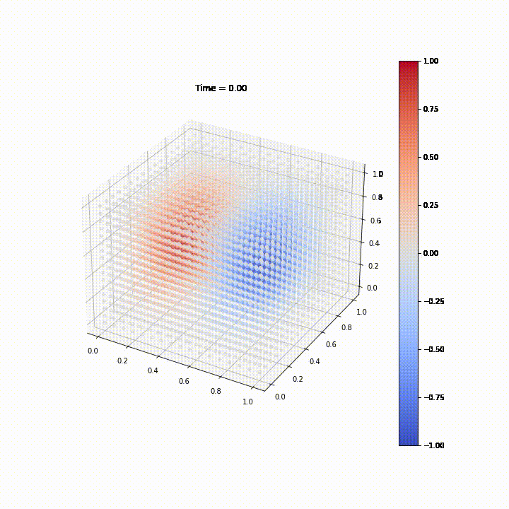
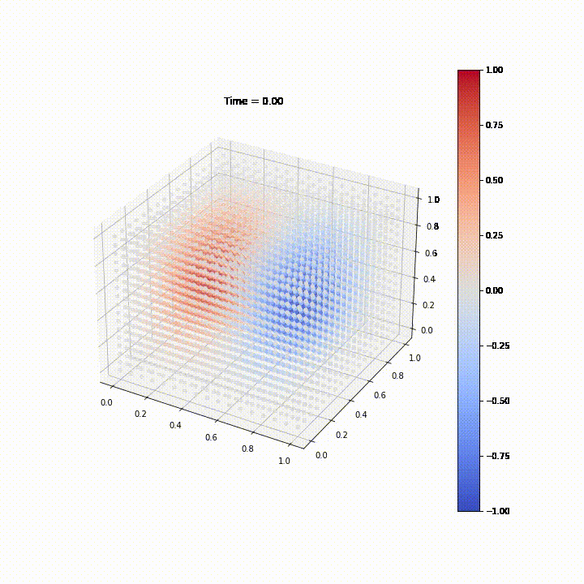
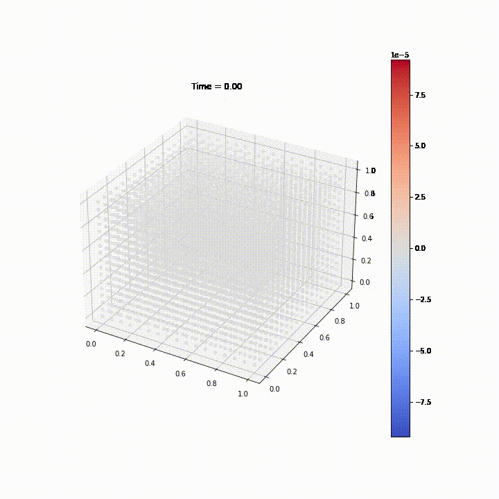

**Запуск задачи на кластере**

1. ```build.sh``` - компилирует бинарник
2. ```run.sh``` - ставит задачку в очередь
3. ```job.lsf``` - параметры запуска задачи в очередь


**Файлы в репозитории**

1. ```main.cpp``` - реализация численного метода без использования OpenMP
2. ```omp.cpp``` - аналогичная реализация метода с использованием OpenMP
3. ```run.py``` - скрипт по формированию конфигов для задач для тестирования масштабирования
4. ```run_jobs.py``` - скрипт для запуска задач для тестирования масштабирования
5. ```test.ipynb``` - ноутбук для визуализации функций и ошибки
6. ```videos/``` - набор видео с отрисовкой функции
    - ```analytical.mp4``` - видео с аналитической сеткой
    - ```computed.mp4``` - видео с посчитанной сеткой
    - ```error.mp4``` - видео с сеткой ошибок, ошибка считалас, как abs(computed_matrix - analytical_matrix)


**Запуск решения**

```bash
./main Lx Ly Lz N T K save_mode
./omp Lx Ly Lz N T K save_mode
```
- Lx Ly Lz N T K - параметры сетки
- save_mode - flag, который отвечает за сохранение рассчитанной матрицы или нет


**Анимированаая визуализация**


Аналитическая сетка



Рассчитанная сетка



Ошибка между рассчитанной и аналитической сеткой
